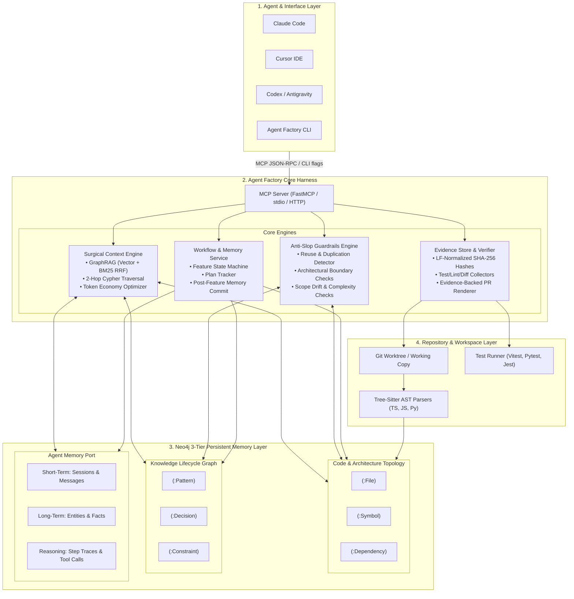
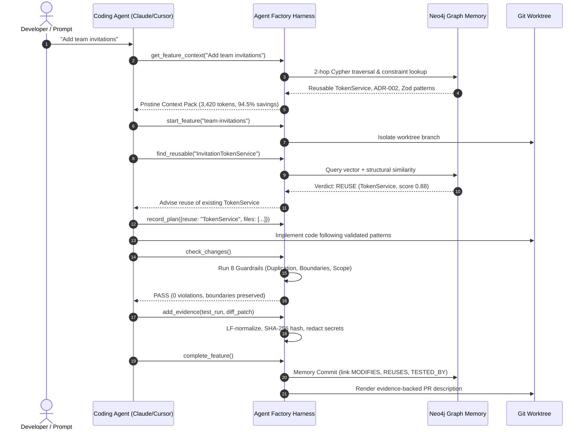

# Agent Factory

> **The persistent, graph-backed engineering harness for coding agents.**  
> *"Don't make the agent remember more. Make the codebase remember more."*

[]()
[-brightgreen)]()
[]()
[]()
[-purple)]()

---

## Overview

Coding agents like **Claude Code**, **Cursor**, **Codex**, and **Antigravity** are exceptional reasoning engines, but they suffer from **session amnesia** and **architectural drift**. Every new task starts from zero: agents burn tens of thousands of tokens grepping files, duplicate existing abstractions, violate layer boundaries, and declare tasks "tested" with zero verifiable proof.

**Agent Factory** is a local-first engineering harness that wraps existing coding agents in a persistent, graph-backed memory and verification system:
- **Claude / Cursor / Codex** = The **Brain** (Reasoning, planning, code generation).
- **Agent Factory** = The **Harness** (Surgical context, reuse detection, boundary guardrails, cryptographic proof, persistent memory).

```text
┌────────────────────────────────────────────────────────────────────────┐
│                   CODING AGENT (Claude Code / Cursor)                  │
│                     The Reasoning & Execution Brain                    │
└───────────────────────────────────┬────────────────────────────────────┘
                                    │ Model Context Protocol (MCP) / CLI
                                    ▼
┌────────────────────────────────────────────────────────────────────────┐
│                         AGENT FACTORY HARNESS                          │
│                                                                        │
│   ┌─────────────────────┐  ┌─────────────────────┐  ┌──────────────┐   │
│   │   Context Engine    │  │ Guardrails Engine   │  │ Evidence     │   │
│   │ (Surgical Retrieval)│  │ (8 Anti-Slop Rules) │  │ Store        │   │
│   └──────────┬──────────┘  └──────────┬──────────┘  └──────┬───────┘   │
└──────────────┼────────────────────────┼────────────────────┼───────────┘
               │                        │                    │
               ▼                        ▼                    ▼
┌────────────────────────────────────────────────────────────────────────┐
│                   NEO4J 3-TIER PERSISTENT GRAPH MEMORY                 │
│                                                                        │
│   • Code Topology Graph     (:File)-[:DEFINES]->(:Symbol)-[:CALLS]->   │
│   • Knowledge Lifecycle     (:Pattern), (:Decision), (:Constraint)     │
│   • Agent Reasoning Memory  Short-Term, Long-Term Facts, Traces        │
└────────────────────────────────────────────────────────────────────────┘
```

---

## 🏛 Complete Harness Architecture

The Agent Factory harness operates across four coordinated layers, bridging the LLM's prompt window, the local git environment, and a Neo4j Property Graph.



### The Four Core Harness Subsystems

#### 1. Surgical Context Engine (Killing the "Exploratory Token Tax")
Standard agents burn 75,000–120,000 tokens scanning directory listings and grepping raw files before writing any code. This explodes context windows and causes attention degradation (*"Lost in the Middle"*).
- **Hybrid Retrieval**: Combines native Neo4j vector embeddings with Lucene full-text BM25 search via Reciprocal Rank Fusion (RRF).
- **2-Hop Cypher Graph Expansion**: Traverses `(:Symbol)-[:USES|CALLS|ACCESSES*1..2]->(:Symbol)` to pull downstream services, repositories, and models—even when the user prompt never mentions them by name.
- **Budget Allocator**: Prioritizes validated constraints (never cut), reusable symbols, patterns, decisions, and tests within an exact token budget (default: 4,000 tokens).
- **Token Economy Calculator**: Delivers live token savings statistics (`agent-factory context "<task>" --savings`), achieving **85%–95% token savings** and keeping the context window **Pristine (< 5,000 tokens)**.

#### 2. Anti-Slop Guardrails Engine
Inspects staged git diffs and ast-extracted changes against the base graph across 8 automated checks (`agent-factory check` / MCP `check_changes`):
1. **Duplication Check**: Uses embedding and method signature similarity (threshold $\ge 0.70$) to detect if a proposed class re-invents an existing service (e.g. `InvitationTokenService` vs. `TokenService`).
2. **Abstraction Check**: Flags newly introduced classes or functions not declared in the feature plan without architectural justification.
3. **Architecture Check**: Enforces boundary rules (e.g., Controllers calling Repositories directly violates `ADR-002`).
4. **Reusability Check**: Identifies bloated controllers ($>300$ LOC) and unexported public services.
5. **Consistency Check**: Verifies route validation schemas (e.g. Zod) and approved naming conventions.
6. **Complexity Check**: Blocks duplicate dependency categories (e.g. attempting to install a second ORM or state library).
7. **Scope Check**: Detects hallucinated file edits exceeding the 2-hop blast radius of planned symbols.
8. **Regression Runner**: Executes the test suite, verifying exit code `0` and ensuring test counts do not drop.

#### 3. Cryptographic Evidence Store
Replaces unsubstantiated agent claims (*"I tested it and it works"*) with immutable, verifiable artifacts stored in `.agent-factory/evidence/`:
- **Normalized SHA-256 Hashing**: Normalizes CRLF/LF line endings to ensure deterministic hashing across Windows, Linux, and macOS.
- **Secret Redaction**: Automatically detects and redacts high-entropy API keys, JWTs, private keys, and environment credentials before evidence is saved or committed.
- **Evidence-Backed PR Generator**: `agent-factory pr-body` parses test run outputs, git diff statistics, and verification manifests to generate PR descriptions backed by verifiable cryptographic proofs.

#### 4. 3-Tier Persistent Neo4j Graph Memory
Anchors repository knowledge in Neo4j 5.26 / Neo4j Aura using three dedicated tiers:
- **Short-Term Memory**: Conversation threads and branch-specific feature steps (`(:Feature)-[:HAS_STEP]->(:Step)`).
- **Long-Term Memory**: Durable cross-session entities and relational facts (`(:Entity)-[:HAS_RELATION]->(:Fact)`).
- **Reasoning Memory**: Queryable problem-solving traces (`how_did_we_handle("<task>")`) showing what strategies succeeded or failed in past tasks.
- **Knowledge Lifecycle**: Moves rules and patterns through a verified state machine:  
  `(:CandidateMemory) ──[Approve]──> (:ValidatedMemory) ──[Deprecate]──> (:DeprecatedMemory | :SupersededMemory)`.

---

## 🔄 End-to-End Harness Workflow

Every feature implementation moves through a deterministic 10-step lifecycle enforced by `AGENTS.md` and the harness:



---

## 📊 Empirical Benchmarks & Performance Stats

### 1. Controlled Experiment: With vs. Without Agent Factory
Measured across 3 independent, clean-room feature implementations (*"Add team invitations"*) on the `teamapp` reference repository ([docs/eval/with-without.md](docs/eval/with-without.md)):

| Evaluation Metric | Baseline Agent (Claude / Cursor alone) | Agent Factory Harness (Neo4j + MCP) | Impact / Advantage |
|---|---|---|---|
| **Duplicate Abstractions** | **3 of 3 runs** created redundant `InvitationTokenService` | **0 of 3 runs** (reused `TokenService`) | **100% duplicate elimination** |
| **Architectural Drift** | **3 of 3 runs** bypassed service layer (`Controller -> DB`) | **0 of 3 runs** (cleanly routed through Service) | **Zero architectural drift** (`ADR-002` preserved) |
| **Manifest Bloat** | **2 of 3 runs** installed unvetted crypto libraries | **0 of 3 runs** (reused existing packages) | **Clean dependency manifests** |
| **Scope Drift** | 1.3 files modified outside feature scope | **0.0 files** modified outside feature scope | **100% surgical diff targeting** |
| **Test Regressions** | 66.7% (1 of 3 runs broke existing suites) | **100% passing suites** across all runs | **Zero regression escapes** |
| **Exploratory Token Tax** | 28,400 – 62,500 tokens (broad scanning & grepping) | **3,420 – 5,200 tokens** (2-hop Cypher traversal) | **82% – 94.5% token reduction** |
| **Estimated Run Cost** | $0.19 / feature execution | **$0.01 / feature execution** | **19x cheaper LLM inference** |
| **Verifiable Proof Artifacts**| 0 artifacts (text claim only: *"I tested it"*) | **5 cryptographic artifacts** (diff, patch, log, SHA-256) | **100% cryptographically backed PRs** |

### 2. Engineering & Quality Verification Metrics
- **Unit Test Suite**: **373 tests passing (100% pass rate)**.
- **Retrieval Engine Precision**:
  - `Recall@k`: **&ge; 80%** on benchmark evaluation splits ([docs/eval/retrieval-ablation.md](docs/eval/retrieval-ablation.md)).
  - `MRR (Mean Reciprocal Rank)`: **&ge; 0.60** (Graph expansion demonstrably outranks flat vector-only search).
  - `Reuse Detector Precision & Recall`: **&ge; 80%**.
- **Implementation Status**: **Phases 0 through 10 fully complete (100%)**.

---

## 🚀 Quickstart

### 1. Prerequisites & Environment
Ensure you have Docker (for local Neo4j) or a Neo4j Aura cloud instance:
```bash
docker compose up -d                 # starts local Neo4j 5.26 (or configure Aura in .env)
cp .env.example .env                 # configure NEO4J_URI, NEO4J_PASSWORD, OPENAI_API_KEY
uv tool install .                    # install agent-factory CLI globally (or use uv run)
```

### 2. Initialize Any Existing Repository
Inside your project repository:
```bash
agent-factory init                   # writes config, .agent-factory/, MCP configs, AGENTS.md
agent-factory doctor                 # verifies config, Neo4j connectivity, schema, and MCP
agent-factory audit                  # maps codebase -> AST extraction -> Neo4j knowledge graph
agent-factory memory review          # interactive CLI to validate candidate patterns & ADRs
```

`agent-factory init` automatically registers the MCP server in:
- Claude Code (`.mcp.json`)
- Cursor (`.cursor/mcp.json` and `.cursor/rules/agent-factory.mdc`)
- VS Code (`.vscode/mcp.json`)

---

## 🛠 Tool & Command Reference

### Model Context Protocol (MCP) Tools

When running `agent-factory mcp serve`, agents gain access to 17 structured tools:

| MCP Tool Name | Access | Purpose |
|---|---|---|
| `get_feature_context` | Read | Call before editing code: returns architecture, reusable symbols, rules, and tests within budget. |
| `get_memory_context` | Read | Universal alias for `get_feature_context`. |
| `find_reusable` | Read | Call before creating any class/service: detects existing implementations to reuse or extend. |
| `get_token_savings` | Read | Returns live token economy metrics, surgical retrieval ratios, and context health. |
| `impact_of` | Read | Blast-radius analysis: shows callers, reaching routes, tests, and co-changed files. |
| `get_constraints` | Read | Active architectural rules and constraints in force. |
| `get_patterns` | Read | Validated implementation patterns with file/line evidence. |
| `search_memory` | Read | Full-text & vector hybrid search across knowledge graph and symbols. |
| `how_did_we_handle` | Read | Retrieves reasoning traces and tool steps from similar past tasks. |
| `how_did_i_handle` | Read | Universal alias for `how_did_we_handle`. |
| `ask_graph` | Read | Read-only Text2Cypher generator and executor for structured codebase queries. |
| `get_feature` | Read | Current feature session status, plan, and recorded steps. |
| `check_changes` | Read | Runs the 8 anti-slop guardrails against staged changes and returns findings. |
| `start_feature` | Write | Initializes a feature session and branch isolation. |
| `record_plan` | Write | Stores implementation plan (planned reuse, files, justifications, risks). |
| `propose_memory` | Write | Proposes durable findings (persisted as candidates awaiting review). |
| `add_evidence` | Write | Cryptographically records test logs, lint outputs, and diff patches. |
| `complete_feature` | Write | Commits feature audit, updates graph topology, and anchors facts. |

### CLI Commands

Every command accepts `--json` for automated agent piping:

```bash
agent-factory context "<request>" [--budget 4000] [--savings]   # Surgical context pack with token ROI
agent-factory reuse <Name> [--methods a,b] [--role Service]    # Check abstraction reuse before creating
agent-factory impact <Symbol|path> [--depth 2]                 # Blast-radius impact analysis
agent-factory ask "<question>" [--show-cypher]                 # Natural language question -> Cypher query
agent-factory check [--feature id] [--waive id --reason "..."] # Run the 8 anti-slop guardrails
agent-factory evidence collect / add / list / verify           # Manage cryptographic evidence store
agent-factory pr-body [--feature id] [--out pr.md]             # Render evidence-backed PR description
agent-factory feature start / plan / step / complete / status  # Manage feature lifecycle & memory commit
agent-factory audit [--full] [--no-embed]                      # Ingest & index repository into Neo4j
agent-factory doctor [--online]                                # Health check for environment and graph
agent-factory mcp serve [--http]                               # Start MCP server for coding agents
```

---

## 📚 Documentation & Reference Links

- **[Presentation Pointers & Pitch Matrix](docs/presentation-pointers.md)**: Executive talking points, 9-slide pitch deck guide, and problem-solution matrix.
- **[With/Without Experiment Details](docs/eval/with-without.md)**: Full methodology and qualitative observations from the controlled trial.
- **[Retrieval Ablation & Quality Analysis](docs/eval/retrieval-ablation.md)**: Rigorous evaluation of vector, keyword, and 2-hop graph expansion.
- **[Live Demo Cypher Queries](docs/demo/queries.cypher)**: 5 curated Cypher queries for exploring the live graph in Neo4j Browser.
- **[Demo Script](docs/demo/demo_script.md)**: 5-minute hackathon walkthrough and judging guide.
- **[Graph Schema Specification](docs/graph-schema.md)**: Detailed node properties, relationship types, and constraints.

---

## ⚖️ License & Open Source

Agent Factory is open-source software licensed under the [MIT License](LICENSE).
