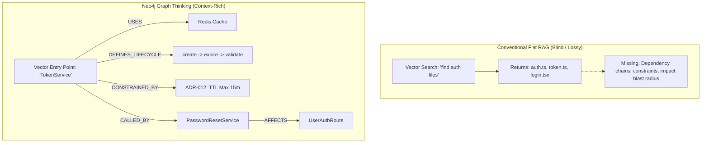
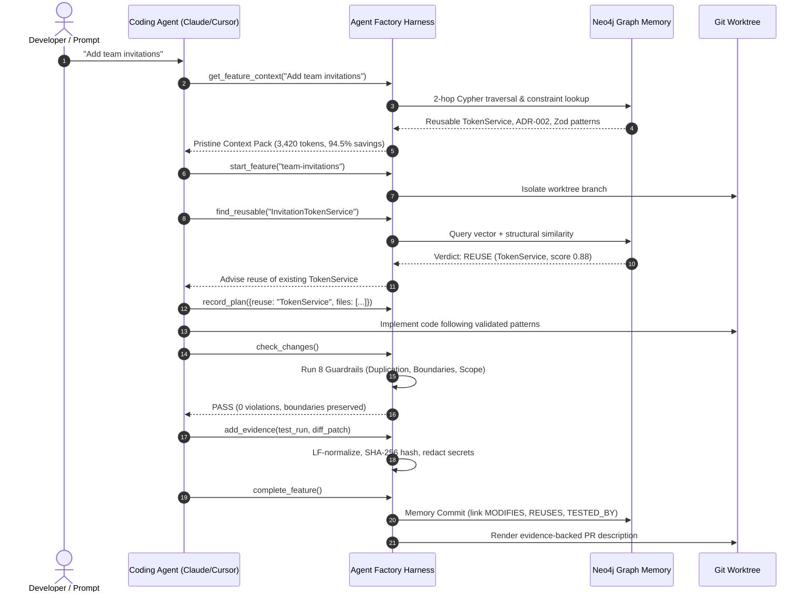

<p align="center">
  
</p>

<h1 align="center">Agent Factory</h1>

<p align="center">
  <b>The persistent, graph-backed engineering harness for coding agents.</b><br>
  <i>"Don't make the agent remember more. Make the codebase remember more."</i>
</p>

<p align="center">
  <a href="https://neo4j.com/"></a>
  <a href="https://modelcontextprotocol.io/"></a>
  
  
  
  
  
</p>

<p align="center">
  <a href="#-executive-overview">Overview</a> •
  <a href="#-problems--solutions">Problems & Solutions</a> •
  <a href="#-why-graph-thinking-neo4j">Why Neo4j?</a> •
  <a href="#-harness-architecture">Architecture</a> •
  <a href="#-the-10-step-lifecycle">Workflow</a> •
  <a href="#-empirical-benchmarks">Benchmarks</a> •
  <a href="#-quickstart">Quickstart</a> •
  <a href="#-mcp-tools--cli-reference">Tools & CLI</a> •
  <a href="#-documentation--links">Docs</a>
</p>

---

## 💡 Executive Overview

Coding assistants like **Claude Code**, **Cursor**, **Codex**, and **Antigravity** are exceptional reasoning and code generation engines. However, in enterprise and large-scale codebases, they suffer from two fatal weaknesses: **session amnesia** and **architectural drift**.

Every new session starts with a blank slate:
- Agents burn tens of thousands of tokens grepping files and reading whole folders before writing a line of code.
- They re-invent existing utilities and services, producing code duplication (*"AI Slop"*).
- They take architectural shortcuts (e.g. controllers querying databases directly), violating system designs.
- They declare pull requests *"tested and complete"* with zero verifiable, cryptographic proof.

**Agent Factory** solves this by separating the **Brain** from the **Harness**:
- **The Brain (Claude / Cursor / Codex):** Focuses entirely on high-level reasoning, planning, and code synthesis.
- **The Harness (Agent Factory):** Supplies surgical GraphRAG context, enforces architectural guardrails, detects duplicate abstractions, and records cryptographic execution evidence.

```text
┌────────────────────────────────────────────────────────────────────────┐
│                   CODING AGENT (Claude Code / Cursor)                  │
│                     The Reasoning & Execution Brain                    │
└───────────────────────────────────┬────────────────────────────────────┘
                                    │ Model Context Protocol (MCP) / CLI
                                    ▼
┌────────────────────────────────────────────────────────────────────────┐
│                         AGENT FACTORY HARNESS                          │
│                                                                        │
│   ┌─────────────────────┐  ┌─────────────────────┐  ┌──────────────┐   │
│   │   Context Engine    │  │ Guardrails Engine   │  │ Evidence     │   │
│   │ (Surgical Retrieval)│  │ (8 Anti-Slop Rules) │  │ Store        │   │
│   └──────────┬──────────┘  └──────────┬──────────┘  └──────┬───────┘   │
└──────────────┼────────────────────────┼────────────────────┼───────────┘
               │                        │                    │
               ▼                        ▼                    ▼
┌────────────────────────────────────────────────────────────────────────┐
│                   NEO4J 3-TIER PERSISTENT GRAPH MEMORY                 │
│                                                                        │
│   • Code Topology Graph     (:File)-[:DEFINES]->(:Symbol)-[:CALLS]->   │
│   • Knowledge Lifecycle     (:Pattern), (:Decision), (:Constraint)     │
│   • Agent Reasoning Memory  Short-Term, Long-Term Facts, Traces        │
└────────────────────────────────────────────────────────────────────────┘
```

> [!TIP]
> **Core Philosophy:** *Don't force the LLM to hold your entire repository in its prompt window. Anchor your codebase's topology, rules, and history in a Neo4j Property Graph, and deliver pristine, surgical context on demand.*

---

## 🎯 Problems & Solutions

| # | The Problem with Coding Agents Today | The Flawed Reality (Without Agent Factory) | Agent Factory Solution (With Neo4j + MCP) | Concrete Engineering Benefit |
| :- | :--- | :--- | :--- | :--- |
| **1** | **Architectural Amnesia** | Every prompt starts from zero. The agent has no memory of past decisions, constraints, or past debug cycles. | **3-Tier Persistent Graph Memory**: Short-term sessions, durable long-term facts, and historical reasoning traces. | Seamless continuity across sessions; builds upon past insights instead of repeating mistakes. |
| **2** | **"AI Slop" & Duplicate Abstractions** | Asked to "add token verification", the agent builds a duplicate `InvitationTokenService` even when a battle-tested `TokenService` exists. | **Graph-Based Reuse Detection**: Vector + AST structural similarity queries detect existing capabilities before coding begins. | Eliminates code bloat; preserves single sources of truth across repositories. |
| **3** | **Architectural Drift & Layer Violations** | Agents take shortcuts: calling repositories from controllers, ignoring ADRs, or introducing unvetted third-party packages. | **Constraint & Decision Memory**: Architectural Decision Records (ADRs) are first-class nodes enforced via 8 anti-slop guardrails. | Automatic enforcement of system designs (e.g. clean architecture, layer separation). |
| **4** | **Exploratory Token Tax & Context Pollution** | Agents scan 20–30 files (80k–120k tokens) before coding, inducing attention degradation (*"Lost in the Middle"*) and sky-high bills. | **Graph-Guided Surgical Retrieval**: Neo4j acts as the codebase GPS, pinpointing the exact 2–3 files to touch within a 4k token budget. | **85%–95% token savings**; pristine context window eliminates hallucinations. |
| **5** | **"Trust Me, It Works" (Lack of Proof)** | Agents claim *"I ran the tests and it works"*, leaving broken regressions or unverified assumptions in pull requests. | **Cryptographic Evidence Store**: LF-normalized SHA-256 hashed test runs, lint outputs, and diff patches attached to PRs. | Maximum reviewer confidence; reproducible, verifiable proof for every commit. |
| **6** | **Agent Lock-in & Tool Fragmentation** | Bespoke agent tools force developers to abandon their favorite editors and workflows. | **Open Model Context Protocol (MCP)**: Native integration via stdio or HTTP into Claude Code, Cursor, Codex, and VS Code. | Zero vendor lock-in. Keep your preferred IDE while Agent Factory works seamlessly behind the scenes. |

---

## 🧠 Why Graph Thinking & Neo4j?

Traditional AI code assistants rely on flat vector search. But code is not a flat document; it is a **deeply interconnected network of relationships**.



### The Library Card Catalog Analogy
> *Imagine entering a massive library to find a specific recipe. Today’s coding agents wander down every aisle, pull 50 random books off the shelves, read page 1 of each, and pile them on their desk until it collapses under the weight.  
> **Agent Factory is the library card catalog.** The agent checks the Neo4j graph index, walks straight to Shelf B, pulls the exact two books needed, and starts cooking immediately.*

### Key Neo4j Capabilities:
- **`VectorCypherRetriever`**: Combines vector indexing (`chunkEmbedding`, 1536 dims) with multi-hop Cypher traversals in a single atomic query.
- **2-Hop Dependency Expansion**: Traverses `(:Symbol)-[:USES|CALLS|ACCESSES*1..2]->(:Symbol)` to reveal downstream services, models, and routes that keyword searches miss.
- **`Text2CypherRetriever`**: Translates natural language questions (*"What endpoints touch TeamRepository?"*) into Cypher via live graph schema visualization (`CALL db.schema.visualization()`).
- **Knowledge Lifecycle State Machine**: Moves rules through verified states:
  `(:CandidateMemory) ──[Approve]──> (:ValidatedMemory) ──[Deprecate]──> (:DeprecatedMemory)`

---

## 🏛 Harness Architecture

Agent Factory coordinates four modular layers, connecting the LLM's prompt window, local Git worktrees, and the Neo4j Property Graph:


---

## 🔄 The 10-Step Lifecycle

Every feature implementation moves through a deterministic, verified lifecycle enforced by `AGENTS.md` and the harness:



---

## 📊 Empirical Benchmarks

### Controlled Clean-Room Experiment: With vs. Without Agent Factory
Evaluated across 3 independent, clean-room feature implementations (*"Add team invitations"*) on the `teamapp` reference repository ([Full Evaluation Report](docs/eval/with-without.md)):

| Evaluation Metric | Baseline Agent (Claude / Cursor alone) | Agent Factory Harness (Neo4j + MCP) | Advantage / Impact |
| :--- | :--- | :--- | :--- |
| **Duplicate Abstractions** | **3 of 3 runs** created redundant `InvitationTokenService` | **0 of 3 runs** (reused `TokenService`) | **100% duplicate elimination** |
| **Architectural Drift** | **3 of 3 runs** bypassed service layer (`Controller -> DB`) | **0 of 3 runs** (cleanly routed through Service) | **Zero architectural drift** (`ADR-002` preserved) |
| **Manifest Bloat** | **2 of 3 runs** installed unvetted crypto packages | **0 of 3 runs** (reused existing packages) | **Clean dependency manifests** |
| **Scope Drift** | 1.3 files modified outside feature scope | **0.0 files** modified outside feature scope | **100% surgical diff targeting** |
| **Test Regressions** | 66.7% (1 of 3 runs broke existing suites) | **100% passing suites** across all runs | **Zero regression escapes** |
| **Exploratory Token Tax** | 28,400 – 62,500 tokens (broad scanning & grepping) | **3,420 – 5,200 tokens** (2-hop Cypher traversal) | **82% – 94.5% token reduction** |
| **Estimated Run Cost** | $0.19 / feature execution | **$0.01 / feature execution** | **19x cheaper LLM inference** |
| **Verifiable Proof Artifacts**| 0 artifacts (text claim only: *"I tested it"*) | **5 cryptographic artifacts** (diff, patch, log, SHA-256) | **100% cryptographically backed PRs** |

### Quality & Engineering Verification:
- **Unit Test Suite**: **373 tests passing (100% pass rate)**.
- **Retrieval Engine Precision**:
  - `Recall@k`: **&ge; 80%** on benchmark evaluation splits.
  - `MRR (Mean Reciprocal Rank)`: **&ge; 0.60** (Graph expansion demonstrably outranks flat vector-only search).
  - `Reuse Detector Precision & Recall`: **&ge; 80%**.
- **Implementation Status**: **Phases 0 through 10 fully complete (100%)**.

---

## ⚡ Quickstart

### 1. Prerequisites
Ensure you have Docker (for local Neo4j) or a Neo4j Aura cloud instance, and Python 3.11+:

```bash
# Clone the repository
git clone https://github.com/adityadeokar/agent-factory.git
cd agent-factory

# Start local Neo4j 5.26 instance (or use Neo4j Aura)
docker compose up -d

# Setup environment variables
cp .env.example .env

# Install dependencies using uv
uv tool install .
```

### 2. Initialize Any Existing Repository
Inside your project repository:

```bash
# 1. Initialize configuration, directories, and MCP hooks
agent-factory init

# 2. Verify environment, Neo4j connectivity, and schemas
agent-factory doctor

# 3. Ingest and index your repository into Neo4j
agent-factory audit

# 4. Review candidate architectural patterns and decisions
agent-factory memory review
```

### 3. Editor & IDE Integration
`agent-factory init` automatically registers the MCP server in:
- **Claude Code** (`.mcp.json`)
- **Cursor** (`.cursor/mcp.json` and `.cursor/rules/agent-factory.mdc`)
- **VS Code** (`.vscode/mcp.json`)

---

## 🛠 Tool & Command Reference

### Model Context Protocol (MCP) Tools (17 Tools)

When running `agent-factory mcp serve`, coding agents gain access to 17 structured tools:

| MCP Tool Name | Access | Category | Purpose |
| :--- | :---: | :---: | :--- |
| `get_feature_context` | Read | Context | Returns surgical architecture, reusable symbols, rules, and tests within budget. |
| `get_memory_context` | Read | Context | Universal alias for `get_feature_context`. |
| `find_reusable` | Read | Reuse | Checks vector and AST similarity to detect existing code to reuse before writing code. |
| `get_token_savings` | Read | Metrics | Returns live token economy statistics, retrieval ratios, and context health. |
| `impact_of` | Read | Analysis | Blast-radius analysis: callers, reaching routes, tests, and co-changed files. |
| `get_constraints` | Read | Rules | Active architectural rules, constraints, and ADRs currently in force. |
| `get_patterns` | Read | Rules | Validated implementation patterns with file/line evidence. |
| `search_memory` | Read | Search | Full-text & vector hybrid search across the knowledge graph and codebase symbols. |
| `how_did_we_handle` | Read | Memory | Retrieves reasoning traces and tool execution steps from similar past tasks. |
| `how_did_i_handle` | Read | Memory | Universal alias for `how_did_we_handle`. |
| `ask_graph` | Read | Query | Read-only Text2Cypher generator and executor for structured codebase queries. |
| `get_feature` | Read | Workflow | Current feature session status, plan, and recorded steps. |
| `check_changes` | Read | Guardrails| Runs the 8 anti-slop guardrails against staged changes and returns findings. |
| `start_feature` | Write | Workflow | Initializes a feature session and branch isolation. |
| `record_plan` | Write | Workflow | Stores implementation plan (planned reuse, files, justifications, risks). |
| `propose_memory` | Write | Memory | Proposes durable findings (persisted as candidates awaiting review). |
| `add_evidence` | Write | Evidence | Cryptographically records test logs, lint outputs, and diff patches. |
| `complete_feature` | Write | Workflow | Commits feature audit, updates graph topology, and anchors facts in Neo4j. |

### CLI Commands Cheat Sheet

Every command supports `--json` for automated piping:

```bash
# Surgical context pack with live token savings calculation
agent-factory context "<request>" [--budget 4000] [--savings]

# Check abstraction reuse before creating new classes/services
agent-factory reuse <Name> [--methods a,b] [--role Service]

# Blast-radius impact analysis
agent-factory impact <Symbol|path> [--depth 2]

# Natural language question -> Text2Cypher execution
agent-factory ask "<question>" [--show-cypher]

# Execute the 8 anti-slop guardrails against staged changes
agent-factory check [--feature id] [--waive id --reason "..."]

# Manage cryptographic evidence store
agent-factory evidence collect / add / list / verify

# Render evidence-backed pull request description
agent-factory pr-body [--feature id] [--out pr.md]

# Manage feature lifecycle & memory commit
agent-factory feature start / plan / step / complete / status

# Ingest and index repository AST into Neo4j
agent-factory audit [--full] [--no-embed]

# Verify environment and graph connectivity
agent-factory doctor [--online]

# Start MCP server for coding agents
agent-factory mcp serve [--http]
```

---

## 📚 Documentation & References

- 📋 **[Presentation Pointers & Pitch Matrix](docs/presentation-pointers.md)**: Executive pitch guide, 9-slide pitch deck walkthrough, and problem-solution mapping.
- 🔬 **[With vs. Without Controlled Experiment](docs/eval/with-without.md)**: Full methodology, quantitative metrics, and qualitative observations.
- 📈 **[Retrieval Ablation & Quality Analysis](docs/eval/retrieval-ablation.md)**: Rigorous evaluation of vector, keyword, and 2-hop graph expansion.
- 🔍 **[Live Demo Cypher Queries](docs/demo/queries.cypher)**: Curated Cypher queries for exploring the live graph in Neo4j Browser.
- 🎬 **[Demo Walkthrough Script](docs/demo/demo_script.md)**: 5-minute hackathon walkthrough and judging guide.
- 📐 **[Graph Schema Specification](docs/graph-schema.md)**: Detailed node properties, relationship types, and constraints.
- 🏛 **[Architectural Benefits Deep Dive](docs/BENEFITS.md)**: Comprehensive deep dive on the engineering return on investment.

---

## ⚖️ License & Open Source

Agent Factory is open-source software licensed under the [MIT License](LICENSE).  
Built with ❤️ by [Aditya Deokar](https://github.com/adityadeokar) for the **Neo4j Hackathon**.
