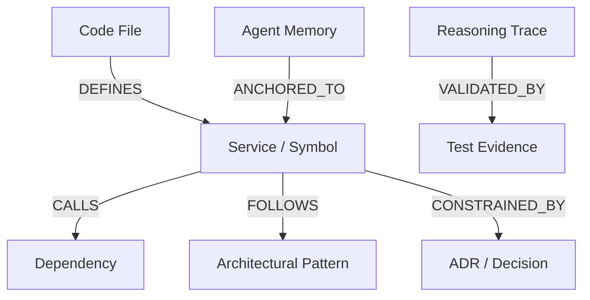

# Agent Factory

A local-first engineering harness that gives the coding agent you already use (Claude Code, Cursor,
Codex, Antigravity) **persistent, evidence-backed codebase memory in Neo4j**.

It builds directly on top of **Software Factory**—the execution workflow foundation that takes coding
agents from task isolation to merged pull requests with verifiable proof (*Isolate → Build → Prove → Ship*
using 10 specialized agent skills, worktree isolation, automated test evidence, and code review loops).

Where **Software Factory** provides the **execution workflow** ("shipping software with proof"),
**Agent Factory** provides the **persistent graph brain**:
- **Zero Architectural Amnesia**: Grounds agents in Neo4j-backed dependency topologies and validated patterns.
- **Exploratory Token Savings**: Eliminates brute-force codebase grepping by querying indexed relationships in milliseconds.
- **Evidence-Backed Knowledge Lifecycle**: Pins architectural claims and constraints to exact source lines (`path:line`), advancing them through a `candidate → validated → deprecated/superseded` lifecycle.

The agent still plans and writes the code. Agent Factory remembers the architecture, the patterns, the
decisions and the constraints, and backs each one with evidence.

## Quickstart

```bash
docker compose up -d                 # local Neo4j 5.26 (or point .env at Aura)
cp .env.example .env                 # fill in NEO4J_* (and OPENAI_* for embeddings)
uv tool install .                    # or: uv run agent-factory ...
cd /path/to/your/repo
agent-factory init                   # config, .agent-factory/, MCP configs, AGENTS.md section
agent-factory doctor                 # config, env, Neo4j, schema, MCP, skills
agent-factory audit                  # repository -> knowledge graph + evidence-backed candidates
agent-factory memory review          # approve / reject what the auditor found
```

## Commands

| Command | What it does |
|---|---|
| `init [--agents ...] [--dry-run] [--skills]` | Sets up the harness. Idempotent, and never deletes anything |
| `doctor [--online]` | Checks everything the harness needs; exit code 0 ok, 1 failed, 2 misconfigured, 3 infra down |
| `status` | Project, schema version, last audit, memory counts |
| `audit [--full] [--dry-run] [--no-embed] [--no-history]` | Observe → map → extract → validate → store. Incremental by default |
| `memory list / show / search / log` | Inspect knowledge, its evidence (`path:line`) and its audit trail |
| `memory approve / reject / deprecate / supersede` | Move knowledge through the lifecycle (candidate → validated → deprecated/superseded) |
| `memory propose --kind --title --claim --evidence path:l1-l2` | Add knowledge; it is validated like everything else |
| `memory export / import / delete / purge` | Back up, restore or remove memory (§30) |
| `memory migrate / schema --md` | Create the graph schema; document it ([docs/graph-schema.md](docs/graph-schema.md)) |
| `context "<request>" [--budget N] [--history]` | The context pack an agent needs before implementing a request (spec §15) |
| `reuse <Name> --desc ... --methods a,b` | Does it already exist? Verdict reuse / extend / new_ok with evidence (spec §16) |
| `impact <Symbol\|path> [--depth N]` | Dependents, routes that reach it, tests to run, co-changed files, rules in force |
| `ask "<question>" [--show-cypher]` | Structured questions about the code graph (Text2Cypher, read-only by force) |
| `feature start / plan / step / status` | Feature sessions: short-term task memory mapped to the branch |
| `mcp serve [--http]` | The MCP server for Claude Code, Cursor, VS Code, Codex, Antigravity |

Every command accepts `--json` (anywhere on the line) for agents.

### MCP tools (`agent-factory mcp serve`)

Read: `get_feature_context`, `find_reusable`, `impact_of`, `get_constraints`, `get_patterns`, `search_memory`,
`ask_graph`, `how_did_we_handle`, `get_feature`. Write (candidates and sessions only): `start_feature`,
`record_plan`, `record_step`, `propose_memory`. Phase 8: `check_changes`, `add_evidence`, `complete_feature`
(they answer `not_available_yet` for now). Retrieval quality: [docs/eval/retrieval-ablation.md](docs/eval/retrieval-ablation.md).

### Skills (Agent Factory)

`project-audit`, `memory-retrieval`, `feature-planning`, `reuse-check`, `architecture-check`,
`implementation-workflow`, `memory-update`, `verification`, `pr-evidence`, `memory-commit`; they chain the
Software Factory skills below. `agent-factory init` wires them into `AGENTS.md`, `CLAUDE.md` and a Cursor rule.

## Development

```bash
uv run pytest                                  # unit tests (fast)
uv run pytest -m "neo4j or contract"           # integration: starts Neo4j via testcontainers
uv run pytest -m "not live and not agent"      # what CI runs
uv run pytest -m live                          # read-only checks against Aura + the LLM proxy (.env.live)
uv run ruff check src tests && uv run mypy src
npm test                                       # skill lint, package check, recorder tests
```

Implementation status (plan in `../plan/implementation/`): Phase 0 (spikes, see [docs/spikes](docs/spikes/README.md)),
1 (CLI, config, dual Neo4j), 2 (graph schema), 3 (Project Auditor), 4 (evidence-backed memory),
5 (context engine, reuse, impact), 6 (MCP server) and 7 (skills) are done.
Phases 8–9 (guardrails and evidence engine, demo) come next.

## Neo4j Usage: How Neo4j Powers Agent Factory

### 1. How Neo4j Powers the Solution
Agent Factory transforms transient coding agents (Claude Code, Cursor, Codex, Antigravity) into persistent, context-aware engineering partners. Instead of forcing agents to re-explore thousands of lines of code or relying on flat, disconnected vector embeddings, Neo4j acts as the **central nervous system and persistent memory layer**. It continuously indexes repository topology, architectural patterns, design decisions, and execution traces, giving agents deterministic architectural context before a single line of code is written.

### 2. What Data Is Modeled as a Graph
Codebases and software architecture are inherently relational. Agent Factory models engineering knowledge using an interconnected **Property Graph**:

- **Code & Architecture Topology**:
  - `(:Repository)-[:CONTAINS]->(:Directory)-[:CONTAINS]->(:File)`
  - `(:File)-[:DEFINES]->(:Symbol {kind: 'class'|'function'})`
  - `(:Symbol)-[:CALLS|:IMPORTS|:EXTENDS]->(:Symbol)`
  - `(:Symbol)-[:FOLLOWS]->(:Pattern {name: 'ServiceLayer'})`
  - `(:Symbol)-[:CONSTRAINED_BY]->(:Decision {title: 'ADR-042'})`
  - `(:Symbol)-[:TESTED_BY]->(:File {path: 'tests/...'})`
- **Evidence-Backed Knowledge Lifecycle**:
  - Architectural claims, design patterns, and constraints are anchored to exact source lines (`path:line_start-line_end`).
  - Graph nodes transition through a validated state machine: `(:CandidateMemory) → (:ValidatedMemory) → (:DeprecatedMemory | :SupersededMemory)`.
- **Three-Tier Agent Memory Architecture**:
  - **Short-Term Memory**: `(:Conversation)-[:HAS_MESSAGE]->(:Message)` with sequential `:NEXT` links and conversational entities.
  - **Long-Term Memory**: Cross-session engineering entities and relational facts: `(:Entity)-[:HAS_RELATION]->(:Fact)`.
  - **Reasoning Memory**: Step-by-step decision traces and tool outputs: `(:ReasoningTrace)-[:HAS_STEP]->(:ReasoningStep)-[:USES_TOOL]->(:ToolCall)`.



### 3. How Data Is Queried and Processed
- **Cypher Traversal & Impact Analysis**: High-speed, multi-hop Cypher queries traverse call graphs and import chains (`MATCH (f:File)-[:DEFINES]->(s)-[:CALLS*1..3]->(dep) RETURN dep`) to compute blast radius and identify candidate reusable services in sub-milliseconds.
- **Hybrid GraphRAG (`neo4j-graphrag`)**:
  - **VectorCypherRetriever**: Pairs native Neo4j vector search on chunk embeddings with 1-hop and 2-hop graph traversals, retrieving semantically relevant code snippets alongside their upstream callers and downstream dependencies.
  - **Text2CypherRetriever**: Translates natural language architectural questions into validated Cypher queries against the schema.
- **Model Context Protocol (MCP)**: Exposes graph-backed tools (`get_architecture_context`, `query_memory`, `check_reuse`, `validate_evidence`) to external agents, injecting precise graph context into prompts.

### 4. Why Neo4j Is Crucial to Our Approach
- **Code Is a Graph, Not a Flat Vector**: Traditional vector databases treat code as flat chunks. They cannot answer hierarchical, multi-hop architectural questions like *"What services break if I alter this data model?"* or *"Does this new service duplicate an existing one?"* Neo4j solves this naturally through graph topology.
- **Eliminating the "Exploratory Token Tax"**: Coding agents spend 15,000–40,000 tokens per task recursively grepping directories and reading files to understand context. Agent Factory uses Neo4j to resolve architectural dependencies in 2 hops, cutting exploratory token consumption by up to **80%** and preventing context window dilution.
- **Institutional Memory Across Sessions**: Agents suffer from session amnesia; every new prompt starts from zero. Neo4j provides persistent, evidence-backed memory that persists across branches, agents, and team members, ensuring architectural decisions are remembered and enforced.

---

# Software Factory

Agent skills for shipping software with proof. Ten skills that take a task from
an isolated branch to a merged PR with evidence attached, wired together by a
single `AGENTS.md` workflow.

Works with Claude Code, Cursor, Codex, GitHub Copilot, OpenCode, Windsurf, and
[75 more agents](https://github.com/vercel-labs/skills#supported-agents).

```bash
npx skills add aditya-deokar/software-factory
```

## Why this exists

An agent that says "I fixed it and tested it" has told you nothing you can
check. These skills replace that claim with artifacts: a branch that cannot
collide with another agent's, a screenshot pair in the PR body, a recorded
session showing the test being performed, and a review score that has to reach
5/5 before merge.

Longer version in [docs/BENEFITS.md](docs/BENEFITS.md).

## The four beats

Every task moves through the same shape. [`AGENTS.md`](AGENTS.md) is the file
that enforces it; drop it into any repo alongside the skills.

| Beat | Skill | What you get |
|---|---|---|
| Isolate | `worktree-isolation` | A worktree and branch per task. Parallel agents stop colliding. |
| Build | `service-layer` | Actions own the why, services own the how. One fix propagates everywhere. |
| Prove | `test-evidence` | A recording of the test being run, annotated and attached. |
| Ship | `visual-diff`, `code-review-loop` | Before/after table in the PR, iterated to a clean review. |

`prose-cleanup` runs across everything a person will read, at every beat.

## All ten skills

### Workflow

- **[worktree-isolation](skills/worktree-isolation/SKILL.md)** - A branch alone does not
  isolate anything; two agents in one checkout interleave edits regardless. Sets
  up a worktree per task, checks for overlap with work already in flight before
  starting, and covers what worktrees do *not* isolate: ports, databases,
  lockfiles, global config.

- **[service-layer](skills/service-layer/SKILL.md)** - Two questions decide
  where code lives: would it change if the product rules changed, or if the
  vendor changed. Boundaries own the first, services own the second. Ships an
  ordered extraction procedure you can stop partway through, and the five ways
  it usually goes wrong.

- **[test-evidence](skills/test-evidence/SKILL.md)** -
  Replace "I tested it and it works" with an artifact. The bundled recorder
  (`scripts/record.py`) captures the session while the agent drives the app,
  burns timestamped pass/fail annotations into `evidence.mp4`, and writes a
  report. Headless environments fall back to scripted screenshots; changes with
  no visible surface still produce evidence as measured numbers and output
  pairs.

### Shipping

- **[visual-diff](skills/visual-diff/SKILL.md)** - Drives the
  `@vercel/before-and-after` CLI to produce a PR-ready `| Before | After |`
  table from two URLs, two images, or a mix.

- **[code-review-loop](skills/code-review-loop/SKILL.md)** - Iterates a PR, MR, or shelved
  changelist until Greptile gives 5/5 confidence with zero unresolved comments.
  Triggers the review, fixes actionable comments, resolves threads, pushes,
  repeats, up to `--max-iterations` (default 10).

- **[code-review-loop-large](skills/code-review-loop-large/SKILL.md)** - The same loop, triggered
  by tagging `@greptile-apps`, which bypasses the file-count limit that makes
  Greptile refuse huge PRs. Use when code-review-loop gets "Too many files changed for
  review".

### Craft

- **[prose-cleanup](skills/prose-cleanup/SKILL.md)** - Cuts AI tells from anything a person
  will read. Names 31 patterns (puffery, filler, hedging, chatbot phrases, em
  dashes, colons as connectors, bold and emoji overuse, abstract metaphor
  nouns, passive voice) and applies them as a four-step loop.

- **[skill-authoring](skills/skill-authoring/SKILL.md)** - Write and audit skills that
  actually load. Covers trigger-focused descriptions, the frontmatter fields
  that matter, the layout the CLI discovers, and a debugging order for a skill
  that never fires.

- **[package-release](skills/package-release/SKILL.md)** - Cut and publish a
  versioned release. Semver rules specific to skills, a pre-publish audit, npm
  scoped publishing, GitHub releases, and what rollback actually looks like
  when npm will not let you republish a version.

- **[cross-platform-shell](skills/cross-platform-shell/SKILL.md)** - Commands that run on
  Windows. PowerShell 5.1 traps, a POSIX translation table, path and
  line-ending rules, and why `npx skills add --copy` is the fix when symlinks
  fail.

## Install

```bash
# Everything, into the project
npx skills add aditya-deokar/software-factory

# Everything, available in every project
npx skills add aditya-deokar/software-factory --global

# Pick specific skills
npx skills add aditya-deokar/software-factory --skill worktree-isolation --skill prose-cleanup

# Target specific agents
npx skills add aditya-deokar/software-factory -a claude-code -a cursor

# See what is in here without installing
npx skills add aditya-deokar/software-factory --list
```

On Windows, symlinking needs Developer Mode or an elevated shell. If install
fails, add `--copy`.

From npm, if you prefer a pinned version:

```bash
npm install --save-dev @software-factory/skills
npx skills add ./node_modules/@software-factory/skills
```

Full walkthrough in [docs/USAGE.md](docs/USAGE.md).

## Use one without installing

```bash
npx skills use aditya-deokar/software-factory@prose-cleanup | claude
```

## Documentation

| Doc | What is in it |
|---|---|
| [docs/ROADMAP.md](docs/ROADMAP.md) | The publishing plan. Six phases from empty repo to a listed, versioned package. |
| [docs/USAGE.md](docs/USAGE.md) | How to use these skills in a real project, with worked examples. |
| [docs/BENEFITS.md](docs/BENEFITS.md) | What each skill is worth, and where the value does not show up. |
| [NOTICE.md](NOTICE.md) | Origin and license of every skill. Read before publishing. |
| [AGENTS.md](AGENTS.md) | The workflow file. Copy into any repo. |

## Development

```bash
node scripts/lint-skills.mjs        # validate frontmatter, layout, paths
node scripts/lint-skills.mjs --strict   # warnings fail too
npx skills add . --list             # confirm the CLI discovers everything
python -m pytest tests/ -q          # recorder smoke tests
npm pack --dry-run                  # inspect the published tarball
```

The linter runs on `prepublishOnly`, so a broken skill cannot reach npm.

## Licensing

Seven skills are original work under the root MIT license, which also covers the
packaging, `scripts/`, and the docs. Three are vendored and keep their upstream
licenses in their own folders: `code-review-loop` and `code-review-loop-large` (MIT, Greptile),
`prose-cleanup` (MIT, Cursor), and `visual-diff` (PolyForm Shield 1.0.0, Vercel
Labs, which is source-available rather than open source).

[NOTICE.md](NOTICE.md) records the origin of every skill and what was changed
from upstream.

## Credits

`visual-diff` from [vercel-labs](https://github.com/vercel-labs/before-and-after),
`code-review-loop` from [greptileai](https://github.com/greptileai/skills), `prose-cleanup`
from [cursor](https://github.com/cursor/plugins). The subject matter of
`service-layer`, `worktree-isolation`, and `test-evidence` was prompted by
[michaelshimeles/skills](https://github.com/michaelshimeles/skills); the skills
here were written from scratch.
